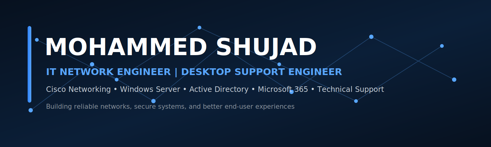

  

<h1 align="center">Mohammed Shujad</h1>

  <strong>IT Network Engineer • Desktop Support Engineer • Technical Support Specialist</strong>

  
  
  

  📍 Khobar, Saudi Arabia &nbsp;•&nbsp; Available for IT Network, Desktop Support, and Technical Support opportunities

---

## 👨‍💻 Professional Profile

IT Network Engineer and Technical Support professional with **3+ years of experience** supporting enterprise networks, Windows environments, and end users. Experienced in LAN/WAN, Wi-Fi, VPN, Cisco routing and switching, Windows Server, Active Directory, Microsoft 365, desktop troubleshooting, and IT incident management.

I focus on practical troubleshooting, reliable infrastructure, clear technical documentation, and user-focused support.

<table>
  <tr>
    <td align="center"><strong>3+ Years</strong> IT Experience</td>
    <td align="center"><strong>500+</strong> Incidents Resolved</td>
    <td align="center"><strong>L1 / L2</strong> Technical Support</td>
    <td align="center"><strong>KSA & India</strong> Work Experience</td>
  </tr>
</table>

---

## 🧰 Technical Skills

### Networking

### Systems Administration

### Desktop and Technical Support

### Cloud and Virtualization

---

## 🚀 Featured Projects

### 1. [Enterprise Office Network Lab](https://github.com/MohammedShujad/enterprise-office-network-lab)

A simulated business network designed with department-based VLANs, inter-VLAN routing, DHCP, ACLs, wireless access, and documented connectivity tests.

**Technologies:** `Cisco Packet Tracer` `Cisco IOS` `VLAN` `DHCP` `ACL` `OSPF`

---

### 2. [Windows Server and Active Directory Lab](https://github.com/MohammedShujad/windows-server-active-directory-lab)

A Windows domain lab demonstrating Active Directory, Organizational Units, users and groups, DNS, DHCP, Group Policy, shared folders, and Windows workstation domain joining.

**Technologies:** `Windows Server` `Active Directory` `DNS` `DHCP` `Group Policy` `VMware`

---

### 3. [Desktop Deployment and Onboarding Guide](https://github.com/MohammedShujad/desktop-deployment-onboarding-guide)

A practical desktop-support project covering Windows deployment, driver installation, Microsoft 365 setup, endpoint security, domain joining, printer configuration, testing, and device handover.

**Technologies:** `Windows 11` `Microsoft 365` `Active Directory` `Microsoft Defender` `OneDrive`

---

### 4. [IT Support Knowledge Base](https://github.com/MohammedShujad/it-support-knowledge-base)

A structured collection of troubleshooting articles for common desktop, account, Microsoft 365, printer, VPN, DNS, DHCP, and network-connectivity incidents.

**Technologies:** `Windows` `Microsoft 365` `TCP/IP` `RDP` `AnyDesk` `ITSM`

---

## 🏢 Experience Highlights

- Supported enterprise LAN, WAN, Wi-Fi, VPN, Cisco routers, switches, and Windows environments.
- Administered Windows Server, Active Directory, DNS, DHCP, Group Policy, and user access.
- Delivered Level 1 and Level 2 support for desktops, laptops, printers, IP phones, mobile devices, and meeting-room systems.
- Supported Microsoft 365, Outlook, Teams, OneDrive, Exchange Online, and Office applications.
- Performed employee onboarding and offboarding, endpoint setup, preventive maintenance, patching, and documentation.
- Worked with vendors, ISPs, and cross-functional teams during infrastructure support and upgrade activities.

---

## 🎓 Education and Certifications

- **Bachelor of Engineering in Computer Science** — Visvesvaraya Technological University
- **Diploma in Computer Science** — GOK, Department of Technology
- **Cisco Certified Network Associate (CCNA)**
- **CompTIA Network+**
- **DevOps + AWS**

---

## 📊 GitHub Activity

  
  

---

## 📫 Contact

I am open to opportunities in:

- IT Network Engineering
- Network Administration
- Desktop Support
- Technical Support
- IT Infrastructure Support

**Email:** [mohd.shujad666@gmail.com](mailto:mohd.shujad666@gmail.com)  
**LinkedIn:**(https://www.linkedin.com/in/mohammad-shujad/)

  <strong>Reliable networks. Secure systems. Better user support.</strong>

